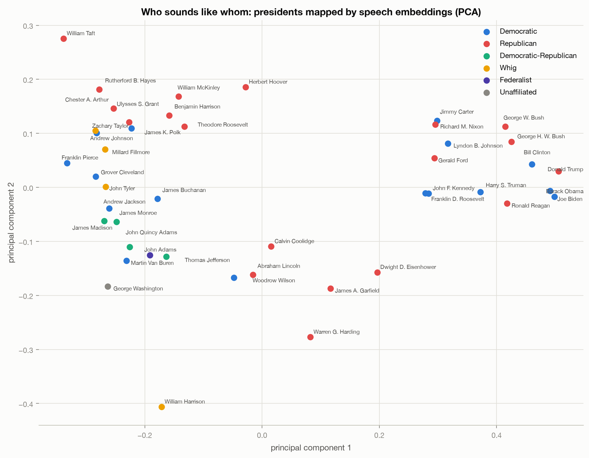
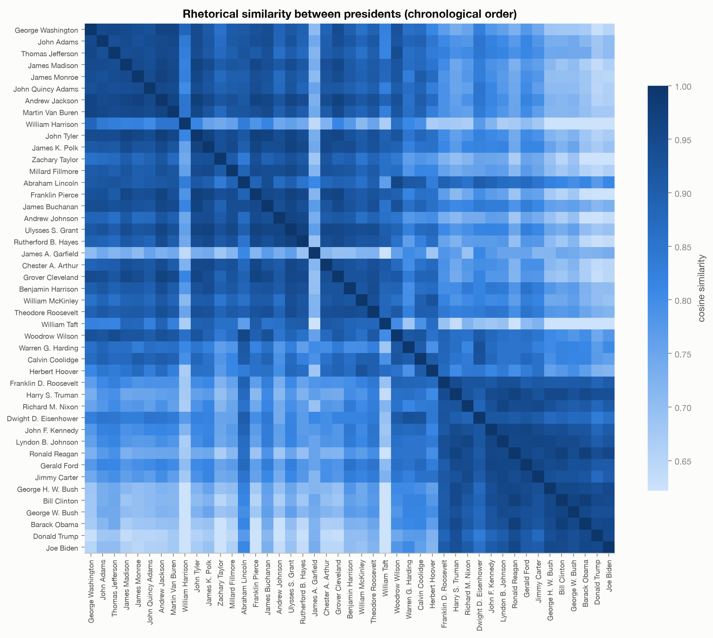
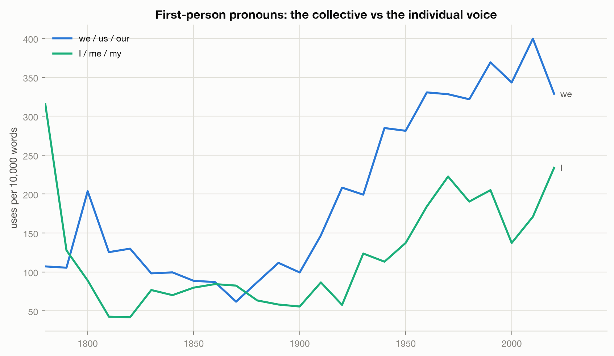
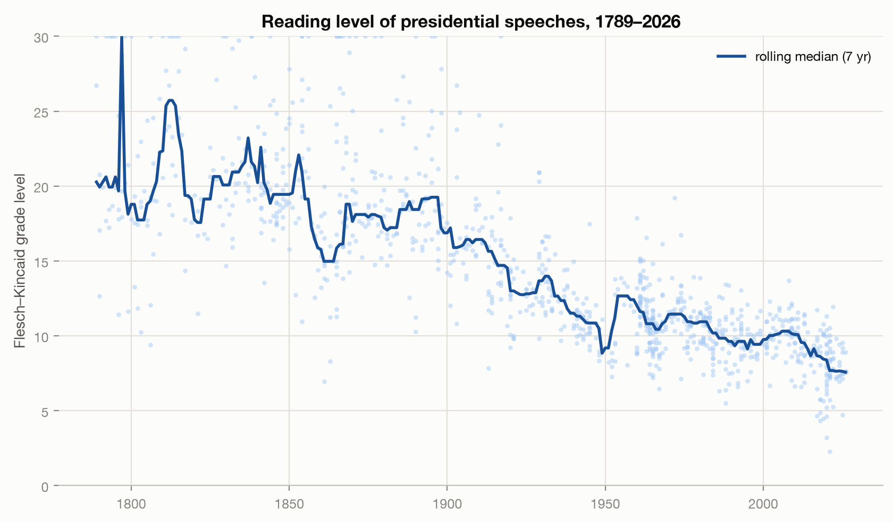
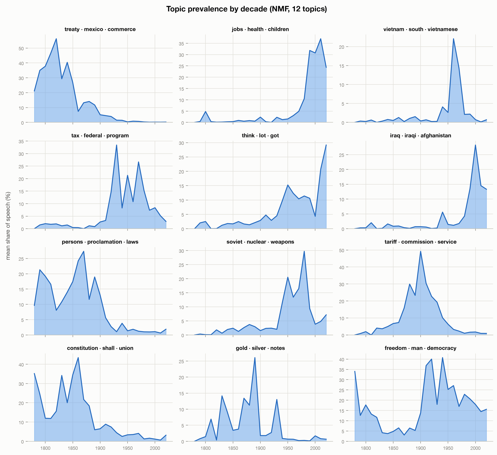
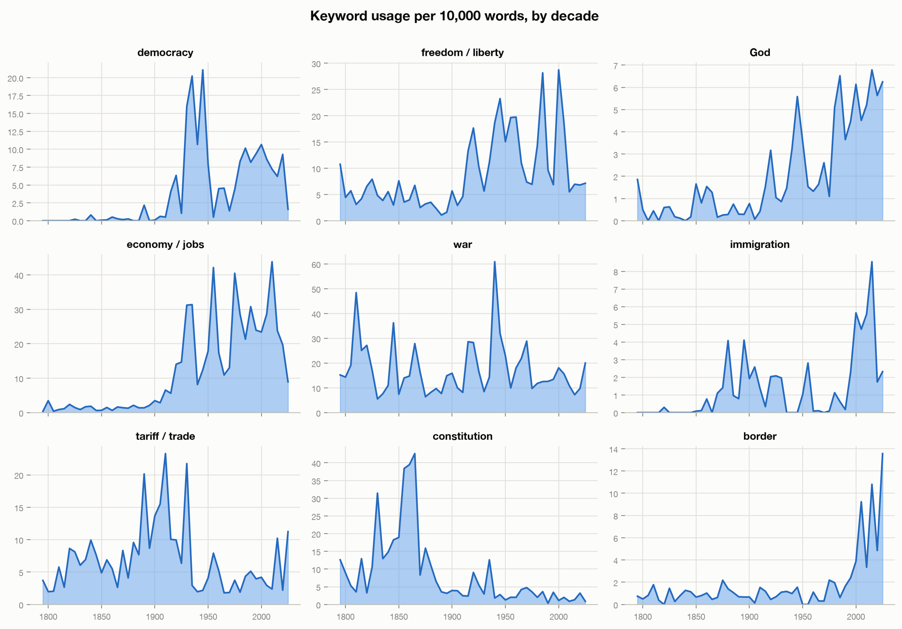
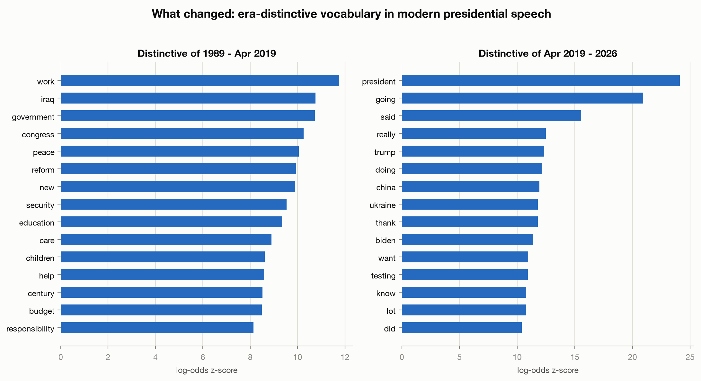

# Presidential Profiles

How presidential rhetoric, issues, and policies manifest for each president — and across the
whole sweep of U.S. history. An NLP analysis of every speech in the
[Miller Center](https://millercenter.org/the-presidency/presidential-speeches) corpus:
**1,057 speeches, 4.2 million words, George Washington's 1789 inaugural through April 2026.**

Originally a 2019 Galvanize data-science capstone; rebuilt in 2026 on the official Miller Center
data release with a modern Python pipeline. The original code is preserved in [`legacy/`](legacy/).

**➡ [Interactive site](https://jacobfulfyll.github.io/presidential_profiles/)** — every
trend as a live chart — the issue and topic trends carrying confidence bands that widen where the
record is thin instead of dropping the thin years — plus **[45 president profile pages](https://jacobfulfyll.github.io/presidential_profiles/presidents/)**:
each follows Overview → Agenda → Rhetoric → Connections → Similarity → Signature speeches →
Evidence, with Evidence last and closed initially. Rhetoric uses server-rendered semantic bars
rather than profile Plotly payloads; legacy Evidence names its document-owner population and
supplies exact counts, selection reasons, keyed Miller receipts, speaker/owner attribution, and
limitations. Connections separately uses eligible actual-speaker paragraphs for a
field-preserving topic ego whose topic nodes can be clicked or keyboard-activated to emphasize
their paths. The former topic audit panel and complete focal-topic record are absent. One joined
`Invoked` / `Invoked by` radio control switches a stable location between the two top-five count
lists; the invocation diagram and hover/focus previews are gone, and topic expansion is reversible.
The directory remains in canonical chronology and adds progressive name-only search. Core Profile V3
measures remain document-owner based, protected Compare values are unchanged, and presidents with
fewer than five source speeches still receive no synthetic percentile rank.
The generated
[Compare workspace](docs/compare.html) places two or three records into one narrative: Profile V3
rhetorical fingerprints, a progressive agenda comparison, and comparison-wide evidence. The default
agenda is the governed-order union of each selected president’s three highest-share broad AI topics;
badges name the president or presidents who contributed each row, and overlapping marks are staggered.
The Compare agenda exposes neither fine-topic rows nor the earlier CorEx model. Selecting a named
president value opens its exact broad-topic share, numerator, denominator, appearance count, and one
topic example directly beneath the row. Exact support states and the full actual-speaker topic CSV remain
available, while Plotly and Compare JSON load only as their sections approach. The
generated [Issues directory](docs/issues/index.html)
opens 16 validated profiles whose supported-period summaries, keyed excerpts, president rankings,
exact tables, JSON, and tidy downloads all come from the same per-issue contract; broad CorEx and
exploratory AI-topic evidence remain visibly separate. Generated by `uv run pp-site` into
[`docs/`](docs/).

## Findings

### Who sounds like whom

Every speech is embedded ([model2vec](https://github.com/MinishLab/model2vec) static embeddings),
averaged per president, and projected to 2D with PCA. **The first principal component is,
almost perfectly, time** — presidents drift steadily across the map in chronological order,
even though the model never sees a date. The modern era (FDR onward) forms its own tight
cluster, far from the founders.



The pairwise similarity matrix tells the same story: a dark "modern block" starting around FDR.
The most similar pair of presidents in the whole corpus is **Bill Clinton ↔ Barack Obama**
(cosine 0.978). Among presidents with substantial speech records, **Donald Trump is the most
rhetorically distinct from everyone else** — his average similarity to the other 44 presidents
is the lowest of any president not cut short after a handful of speeches (only William Harrison,
who died a month into office, and James Garfield rank lower).



Interactive versions with hover detail:
[president map](outputs/interactive/president_map.html) ·
[similarity heatmap](outputs/interactive/similarity_heatmap.html)

### The 2020s flipped the pronoun trend

Presidential speech spent a century becoming more collective: "we / us / our" climbed from
~100 uses per 10,000 words in 1900 to ~400 in the 2010s. **The 2020s reversed it.** "We" fell
back to 329 while first-person singular ("I / me / my") surged to 234 per 10k words — the
highest of any decade since George Washington's personal addresses in the 1790s.



### Speeches dropped twelve grade levels

Median Flesch–Kincaid reading level fell from **grade 19.9 in the 1790s to grade 7.8 in the
2020s** — from dense written orations addressed to Congress to televised (and tweeted) plain
speech addressed to everyone.



### What presidents talk about, 1789–2026

Twelve NMF topics over the full corpus trace the arc of American history: treaties and
commerce dominate the early republic, the Constitution and union peak in the 1860s, gold and
silver in the 1890s, tariffs around 1910, the Soviet/nuclear block in the Cold War, Vietnam in
the 1960s–70s, Iraq/Afghanistan in the 2000s — and a "think · lot · got" informal-register
topic that barely existed before television and explodes in the 2020s.



Keyword rates per 10k words show the same history in single words — note **"border" and
"immigration" reaching all-time highs in the 2020s**, well above the previous immigration-era
peaks of the early 1900s:



### What's new since 2019

Log-odds comparison (Monroe et al. informative Dirichlet prior) of the 64 speeches added since
this project's original 2019 snapshot against the 1989–2019 baseline: **ukraine, china,
testing** (the COVID era), and a marked shift toward informal narration — "going", "said",
"really", "yeah" as statistically distinctive presidential vocabulary.



## Data

The corpus is the Miller Center of Public Affairs (University of Virginia) official speech
release: [data.millercenter.org](https://data.millercenter.org). Speeches are in the public
domain; the collection is curated by Miller Center staff and is not exhaustive. Attribution:
Miller Center of Public Affairs, University of Virginia.

`data/speeches.parquet` is the normalized corpus (one row per speech, cleaned plain-text
transcript). The other parquet files are derived tables the pipeline caches so you can explore
results without recomputing. Paragraph-level tables (`paragraphs.parquet`, `paragraph_issues.parquet`)
share a `(doc_name, para_idx)` key — join on it rather than assuming row order.

`data/paragraph_clusters.parquet` holds per-paragraph cluster assignments at k=40 and k=15,
keyed the same way; `paragraph_clusters_meta.json` carries each cluster's size, top terms, and
NPMI coherence.

`data/era_boundaries/` is the deterministic `$0` `era-boundaries-v3` review layer behind the
site's [Era Choices page](docs/era-boundaries.html). Its hashed bundle tests local transition
scores, contiguous partitions, cluster stability, alternative segment lengths and grid offsets,
axis and axis-family weighting, terminal-cycle exclusion, leave-one-family-out conditions, and a
common-genre condition. The public condition, support, objective, similarity, driver, and
right-censor receipts live under `docs/data/era-boundaries-v3/`; compatible older download URLs
remain available. These results describe segmentation sensitivity. `ERA_PROFILE_SPECS` remains the
sole owner of the nine public Story-era identities and anchors, and exact chapter dates remain
reviewed historical/editorial judgments rather than algorithmic output.

The five data-trust surfaces are [Data Quality](docs/data-quality.html),
[Methods](docs/methodology.html), [Era Choices](docs/era-boundaries.html),
[Model Comparison](docs/label-models.html), and the [Metric Dictionary](docs/metrics.html). They
share a quick-verdict → visual-explanation → technical-evidence reading model and a local
navigation system. `data-quality-v2` publishes its population, agreement, treatment, uncertainty,
and provenance contracts through `docs/data/quality/manifest_v2.json`; each substantive figure
names its registered metric and exact evidence artifact. The coarse POS analysis is now a Methods
feature-engineering appendix governed by `grammar-pos-v2` in `data/grammar/manifest.json`, which
pins the corpus, spaCy runtime, model package, outputs, and stale-cache checks.

`data-trust-validation-protocols-v1` is a deterministic, execution-blocked plan for a future
blinded human-validity study and paired decade-hidden sensitivity experiment. Its governed receipt
is `data/validation_protocols/v1/manifest_v1.json`; only the declared non-identifying protocol
projection is copied to `docs/data/validation-protocols-v1/`. No human labels, validity results,
runtime model choice, paid request, or authority to change production labels exists. Restricted
selection keys, coder assignments, and the invariance request plan stay outside the public site
under the Git-ignored `data/validation_protocols/v1/restricted/` tree. Regenerate that local bundle
with the documented `--rebuild` command. This prevents accidental publication but is not
cryptographic secrecy: coders must not access the deterministic builder or reconstruction inputs
before their labels are locked.
See [`notes/data-trust-redesign-v1.md`](notes/data-trust-redesign-v1.md) and
[`notes/data-trust-validation-protocols-v1.md`](notes/data-trust-validation-protocols-v1.md).

LLM-derived annotations live separately under `data/llm_annotations/`, keyed by `doc_name` or
`(doc_name, para_idx)` — never by row order — with every row's `run_id` pointing at a manifest
(model, prompt version + hash, batch id, token counts, cost, corpus fingerprint) so any
annotated value is traceable to what produced it. `invocation_tone.parquet` was the first table
in this layer, migrated from a legacy position-keyed JSON file.

The full corpus is now annotated. `paragraph_annotations.parquet` (36,229 rows, keyed
`(doc_name, para_idx)`) holds topic labels (multi-label against the frozen `taxonomy_v1.json`
50-name set, or none), three binary combativeness flags (`party_attack`, `enemy_naming`,
`zero_sum`), and a `proposal_values` class (proposal / values / mixed / neither) — judged
**masked**: the model sees only the paragraph text and its decade, never the president or speech
title, so the obscure middle of the corpus is judged on its words rather than its author's
reputation. `paragraph_entities.parquet` (27,214 rows, same key) explodes each paragraph's named
entities into a long table (`entity`, `type`, `stance` — adversarial/favorable/neutral), the raw
material the enemy-naming flag cross-validates against. `speech_annotations.parquet` (1,057
rows, keyed `doc_name`) holds `speech_type` / `audience` / `medium`, judged **unmasked** from the
title, year, and opening paragraphs — the title is the single best signal for a factual field
like speech type, so masking there would only make it worse. QA (label rates by decade, flag
co-occurrence, entity-substring face validity) is in
[`notes/annotation-qa-v1.md`](notes/annotation-qa-v1.md).

`taxonomy_v1.json` and `crosswalk_v1.json` are two more artifacts in that layer — not row-keyed
tables but a two-level topic taxonomy derived from the corpus itself: 17 level-1 domains (12
policy, 5 non-policy — ceremonial, personal narrative, procedural/administrative, faith &
values, partisan/media combat) and 50 level-2 topics, plus a crosswalk mapping every one of the
15 legacy issues (+ "Security & peace") onto it. It's frozen: derived and validated against a
held-out sample *before* any bulk annotation pass runs against it — a pre-registration discipline
against researcher degrees of freedom, so the taxonomy can't be quietly reshaped to fit whatever
an annotation run later finds. Provenance (models, prompt hash, exact sample IDs, actual cost)
lives in `data/llm_annotations/manifests/taxonomy-v1-20260719.json`.

`data/register/trends.parquet` (16,243 rows) preserves the original 2,000-draw registered
trend artifact; `data/register/trends_20000.parquet` is the publication inference rebuild with
20,000 bootstrap draws and a no-change-surprise resolution floor of 0.005%. The tables hold how
the formal presidential record's
breadth, depth, and register moved across 240 years — issue entropy, label density,
non-policy share, proposal-vs-values ratio, and 13 style markers — each computed under three
genre treatments (raw / SOTU-only / genre-standardized) and against both taxonomies (the
legacy 15 issues and `taxonomy_v1`'s 50 topics / 17 domains), with speech-clustered bootstrap
CIs. It's long-format, not paragraph-keyed: `unit`, `period`, `measure`, `taxonomy`,
`genre_treatment`, and `statistic` together identify a row. The write-up, including which of
these trends survived their own controls, is
[`notes/register-findings-v1.md`](notes/register-findings-v1.md).

`data/combat/` is the combativeness layer derived from those annotations — the base tables plus
governed speaker-audited Conflict projections, all computed locally with zero API calls.
`combativeness.parquet` is the base deliverable: era × flag × genre
treatment, each row a rate with a 95% **speech-clustered** bootstrap interval (within-speech ICC on
these flags runs as high as 0.17, so resampling paragraphs would understate the interval badly) and
its counts. Three genre treatments ship side by side and none is published alone — `raw` (all
genres), `sotu_only` (the annual message, the one genre present in every era, **co-primary rather
than a control** because the corpus admits more informal genres over time), and
`genre_standardized` (each era's genre mix reweighted to the pooled corpus reference). The three
flags are always reported separately; there is deliberately no composite "combativeness index",
because a weighted sum would hide the fact that they disagree with each other.

`ci_status` is the trust gate on every rate and ratio row and downstream code should read it before
reading `rate`: `suppressed_n_floor` means the cell had too few speech clusters to support an
interval at all (the War & New Deal SOTU cell is 3 annual messages), `low_cluster_caution` means it
has one but a thin one. Alongside it: `ratios.parquet` (present era ÷ every other era, per flag per
treatment), `peak_decades.parquet` (the same at decade grain for the 1860s / 1930s / 2020s),
`exemplars.parquet` (top 10 passages per era per flag, carrying `(doc_name, para_idx)` — join on the
key, not row order — so every point on a chart has receipts), `entity_consistency.parquet`,
`lexical_baseline.parquet`, `adversary_mix.parquet`, `by_president.parquet`,
`genre_decomposition.parquet`, and `combat_meta.json` (seed, thresholds, reference genre weights,
corpus fingerprint). The write-up is
[`notes/combativeness-findings-v1.md`](notes/combativeness-findings-v1.md).

The governed speaker layer additionally publishes
`by_president_treatments_v2.parquet`, the selected
`by_president_speaker_audited_v2.parquet`, and
`target_mix_by_era_speaker_audited_v1.parquet`. The last table pools
`speaker_audited_all` adversarial mentions within the canonical `trends.ERAS` boundaries; it is
the nine-row source for Summary's target trajectories and never averages president or annual
percentages.

`data/speaker_views/` and `data/reference_entities/` provide the versioned
speaker/reference foundation for later page migrations. The 35,394-row
`speaker-view-v1` keeps every attribution outcome, exposes the 32,531 eligible
actual-speaker paragraphs and 2,863 exclusions, and assembles 1,054
source-document appearances without mixing speakers. Pinned local
`en_core_web_sm` NER preserves raw spans over every retained row and aligns
conservatively with promoted primary-AI entities; AI stance remains separate
and nullable. The era table counts a normalized primary-AI entity once per
paragraph, uses every eligible paragraph as the denominator, applies
Jeffreys-smoothed log odds against the other Story eras, and publishes five
supported candidates per era. Story now consumes the governed bundle through a fail-closed reader;
Profiles consume it only through the separately labeled Connections population. Core Profile V3
measures and Compare remain unmigrated. See
[`notes/speaker-reference-foundation-v1.md`](notes/speaker-reference-foundation-v1.md)
and
[`notes/story-reference-entity-migration-v1.md`](notes/story-reference-entity-migration-v1.md),
and validate the fast receipts with
`arch -x86_64 .venv/bin/python -m presidential_profiles.story_foundation --check --site-dir docs`.

`data/speaker_topic_network/` is the reusable
`actual-speaker-topic-network-v1` layer built on that accepted foundation and
the annotation ledger's active promoted primary topic projection. It joins all
35,394 retained paragraph keys one-to-one before eligibility filtering, then
publishes 32,531 eligible paragraph rows, 91,119 distinct Level 1/Level 2
memberships, 112 president/topic nodes, 4,408 corpus/Story-era edges, and
11,576 deterministic evidence receipts. Named-president measures use actual
speakers and actual-speaker appearances; source-document owners remain separate
audit fields. Topic-free paragraphs remain in denominators, multi-label shares
are non-additive, and thin edges remain downloadable. The canonical build
publishes the validated bundle under `docs/data/speaker-topic-network/`.
Summary’s fifth section consumes a field-preserving all-corpus projection under
`docs/data/summary-topic-network/`: one compact Level 1 index, 17 on-demand
Level 2/evidence shards, and a hashed manifest. Its Summary renderer lets users
place up to eight fixed topic anchors around a deterministic president field:
`speaker_paragraph_share` controls each pull and line width, while president
area shows explicitly non-additive selected-topic paragraph memberships.
Deterministic display stretch separates dense positions, a visible readout
explains focused portraits, and users may narrow the field to eight named
presidents without renormalizing portrait size. Topic controls appear above
president controls across the full-width field, and canonical taxonomy sorting
makes layout independent of click order. Summary renders only the 42 supported
presidents and 427 recurring edges; observed/thin rows remain in the unchanged
projection and governed downloads rather than the interface. It never loads the
complete public network or recalculates Plan 3 measures. See
[`notes/story-actual-speaker-topic-network-v1.md`](notes/story-actual-speaker-topic-network-v1.md)
and
[`notes/summary-actual-speaker-topic-network-plan-v1.md`](notes/summary-actual-speaker-topic-network-plan-v1.md).
Validate both public layers with
`arch -x86_64 .venv/bin/python -m presidential_profiles.speaker_topic_network --check --site-dir docs`
and
`arch -x86_64 .venv/bin/python -m presidential_profiles.summary_topic_network --check --site-dir docs`.

`docs/data/profile-context/` is the separate 49-file
`president-profile-context-v1` public layer for profile Connections and enriched legacy Evidence.
It contains one hashed index, one hashed manifest, 45 president shards, and complete invocation
edge/evidence CSVs. Topic relationships are field-preserving all-corpus Level-1 projections from
`actual-speaker-topic-network-v1`; invocation relationships come from the accepted evidence after
the actual-speaker overlay and retain complete fixed-order function and stance counts. Python
precomputes all analytical ordering and default/expanded selections. Profile HTML server-renders
the default topic diagram, both top-five invocation summaries, semantic lists, receipts,
limitations, and downloads. The enhancement module loads near Connections, but JSON is fetched
only after explicit topic expansion; compacting and re-expanding reuse the same payload. The
implementation and acceptance contract is
[`notes/president-profiles-and-navigation-v1.md`](notes/president-profiles-and-navigation-v1.md).
Validate the governed invocation aggregation with
`arch -x86_64 .venv/bin/python -m presidential_profiles.actual_speaker_invocation_network --check`;
the ordinary site build validates and publishes the complete context contract.

`data/attention/topic_lifecycles.parquet` (201 rows) is the first life-history table built on
that annotation layer: one row per `(level, treatment, topic)` — 2 levels × 3 genre treatments ×
50 level-2 topics / 17 level-1 domains — holding each topic's first, peak, and last substantive
year, rise and fall rates, era of relevance, lifecycle class (born / died / persistent /
revived), a rename-vs-death classification, and speech-clustered bootstrap CIs on its first,
peak, and final era shares. It is not paragraph-keyed, so join it on
`(level, treatment, topic)` rather than on `(doc_name, para_idx)` — and never on row order.
Rate columns are stored as **fractions**; the report quotes percentage points. Byte-reproducible
on rerun from a fixed seed. Findings — the clearest births, deaths, and revivals, with exemplar
quotes, per-era sample sizes, and an explicit record of which numbers were re-derived and which
were not — are in [`notes/attention-findings-v1.md`](notes/attention-findings-v1.md).
`data/method_compositions.parquet` (85,617 rows) holds per-speech topic-share vectors from all
three labelers in one long table, keyed `(doc_name, method, topic)`: `method` is `llm_taxonomy`
(the 50 level-2 topics), `corex_legacy` (the 16 crosswalk issues — the 15 legacy issues plus
Security & peace), or `embed_k15` (the 15 embedding clusters). Every method shares the same
per-speech denominator — all paragraphs, including the ones the LLM left unlabeled — so shares
are comparable across methods. `data/method_agreement.parquet` (160 rows) holds Jaccard and
Cohen's kappa between the LLM and CorEx arms for each of the 16 crosswalk issues, both for the
whole corpus (`era` is null) and for each of 9 named eras (144 rows). `data/topic_display_names.json`
decides which CorEx discovered topics are coherent and substantive enough to name and surface on
the site — of the 7, only `Discovered 5` ("Security & peace") clears the bar today — and is what
the site now reads instead of a hardcoded `+ ["Discovered 5"]`. Findings, including a
pre-registered prediction that did *not* hold, are in
[`notes/topic-comparison-report-v1.md`](notes/topic-comparison-report-v1.md).

`agreement_sample_v1.json` persists a second-opinion sample alongside the full-corpus
annotations: 266 speeches (9,048 paragraphs), drawn once with a fixed seed (20260721)
proportionally across the same 30-year era bins, minimum 3 speeches per bin. The committed
**file**, not the seed, is the source of truth for membership — a future hand-graded truth
pass annotates exactly this list, and re-running the draw logic can never silently shift it.
Opus 4.8 — deliberately a different tier from the Sonnet 5 primary — re-annotates the sample
with byte-identical prompts and schemas, so the model is the only variable. Its results land
in per-model-suffixed tables (`paragraph_annotations__opus4-8.parquet`,
`paragraph_entities__opus4-8.parquet`, `speech_annotations__opus4-8.parquet`) rather than the
primary parquets, which are never touched by a second-opinion run.

`data/eras/` fingerprints every era across three grains — the 9 named `trends.ERAS`
eras (`era_fingerprints.parquet`, the reporting grain) plus 31 eight-year bins and 45
presidencies (`fine_fingerprints.parquet`) — on 63 z-scored axes spanning topic mix,
issue mix, style markers, register, combativeness, and speech-type mix.
`era_similarity.parquet` (era grain) and `president_similarity.parquet` (presidency
grain) carry both the raw and the drift-detrended cosine matrix side by side — raw
similarity trivially tracks temporal adjacency (PC1 of presidential language is
time), so the detrended matrix, built by reusing `similarity.py`'s adjacent-era-mean
trick, is what makes genuine non-adjacent rhyme visible — and `nearest_neighbors.parquet`
distills each unit's top match under both. All three carry a `ci_components` column
reading `sampling_only` — the committed artifacts predate `agreement_v1.parquet`'s
landing, and propagating the bands is a groomed follow-up — the same seam convention
as `data/combat/`; check it before trusting an interval.
`periodization.parquet` holds a contiguity-constrained Ward clustering of the
fine-grained fingerprints against the 8 canonical era boundaries at both grains,
plus a leave-one-out rerun with the availability-bounded `opponents` marker dropped,
so a boundary that only exists because of it can be told apart from a real one;
`combativeness_ci_check.parquet` audits that no fingerprint axis was built from a
`suppressed_n_floor` combat cell. `eras_meta.json` carries the axis registry, corpus
fingerprint, and a staleness check against `data/combat/combat_meta.json`.
`era_portraits.parquet` — nine LLM-written era descriptions grounded in each
fingerprint plus exemplar quotes — is a **frozen, paid artifact** ($0.0595 actual;
manifest in `data/eras/manifests/`), and the CLI refuses to overwrite it with
placeholders. Headline finding: the present era's detrended nearest neighbor is
**Civil War & Reconstruction** (cosine 0.315, mutual, a 10.8× gap to #2) — modest in
absolute terms and honestly caveated as such in the write-up,
[`notes/era-atlas-v1.md`](notes/era-atlas-v1.md).

`data/bands.parquet` (1,528 rows) is what puts a shaded confidence band under every issue and
topic trend line, so a 1785 point resting on two speeches no longer looks like a 1965 point
resting on ninety. It is keyed `(surface, series, period)` — not paragraph-keyed — and each row
carries a point estimate, a sampling-only interval, the composed interval, and the counts behind
them. The two surfaces carry deliberately different uncertainty budgets: `corex_issues` (22
series over 49 five-year periods, the labels behind the site's issue charts) is
`ci_components="sampling_only"`, because those labels come from a seeded CorEx topic model with no
LLM annotator anywhere in its pipeline — annotator disagreement isn't missing from those rows, it
is **not applicable** to them. `llm_topics` (50 series over the 9 named eras) is
`sampling+annotator_disagreement`: there the labels *are* the LLM annotations, so the Sonnet-5 vs
Opus-4.8 gap is real uncertainty about the plotted quantity, measured directly as half the
difference between the two annotators' era shares over the 8,570 paragraphs both labeled. Both
components resample **speeches**, not paragraphs. `ci_status` is the trust gate — read it before
`lo`/`hi`, exactly as with `data/combat/` — and thin periods are now shown de-emphasized with wide
bands rather than dropped from the chart (which recovers exactly one period, 1785).

The table has a second gate at a finer grain. Over two speeches a bootstrap has only three
distinct resamples, so when both speeches happen to contain none of an issue every replicate
returns zero and the cell would publish a zero-width interval — a confident zero that actually
means "two speeches told us nothing". Those cells are marked `interval_unresolvable`, publish
**null** bounds rather than a fabricated `0.0`, keep their point estimate (the observed share is
real; only the interval was unknowable), and render as an **open circle** instead of a point on a
line, so the signal survives without a hover. The gate is a conjunction — no variation *and* fewer
than four speeches — precisely so that a well-evidenced zero is not swept up with it: 12 cells,
all at 1785, are withdrawn, while seven genuine confident zeros at 13–14 speeches keep their tight
intervals. The four-speech floor is derived from the CI percentile rather than picked, so retuning
one moves the other. `bands_meta.json` records the seed, the composition rule, that derivation,
the cluster floors and why they differ from `combat.py`'s, and the caveats on the disagreement
half-width in both directions.

`data/expansion_story/period_metrics.parquet` is the deterministic evidence layer for the
1816–1849 story chapter plus its fixed 1850–54 preview. It holds eight exact taxonomy-backed
topic rows and an aligned `enemy_naming` rate over the same eight period columns, with every
denominator retaining topic-free paragraphs. Composite expansion rows are de-duplicated
paragraph-level unions. Each cell carries a 500-draw speech-clustered interval, the existing
support gates, and a paired-model half-range that may widen but never narrow the sampling bounds.
`meta.json` records input fingerprints, union definitions, validated receipt keys, derived
Jackson/entity annotations, paired coverage, and the artifact schema. Rebuild both files
byte-for-byte with `python -m presidential_profiles.expansion_story`; the command is local,
deterministic, and makes no API calls.

### Reusable era profiles

`src/presidential_profiles/era_profiles.py` is the shared data layer for the
nine Era Profile screens. It derives the same contract for every canonical
`trends.ERAS` band—metadata, presidents, claimed constituents, named
adversaries, corpus footprint, major topics, distinctive words, and governing
channels—from the keyed corpus and annotation artifacts. Use
`load_era_profile("expansion")` to select one record by stable key, or
`load_all_era_profiles()` for the ordered nine-era mapping. The site build
publishes the same records to `docs/data/era_profiles.json`; one
era-agnostic renderer in `site.py` displays them. The `era-profile-v4`
contract keeps calendar boundaries intact while assigning an outgoing
president's accession-year speech to the story regime that presidency closes.
Distinctive vocabulary uses the same grouped word-family map and spelling
normalization as Explore, so inflections such as `slavery`, `slave`, and
`slaves` contribute to one family; named-entity overrides give fragments such
as `qaeda` the public family label `al-qaeda`. President-name terms are
excluded before ranking, so names such as Kennedy, Nixon, Bush, and Trump
cannot occupy an era's distinctive-word podium. Rank starts from the informative-prior
log-odds effect size, caps additional ranking credit above a 25× concentration,
and multiplies it by an evidence weight `1 - exp(-era_uses / 100)` that is
nearly saturated by 500 uses. The visible `× other eras` remains the uncapped
raw rate comparison. Eligibility still requires at least 50 corpus uses,
presence in 10 era speeches, and presence under two era presidents. Each Story
card stays deliberately compact: rank, focal-era uses, and the family’s
per-word rate as `× other eras`. The fuller method and eligibility rules begin
collapsed below the cards. Each presidential portrait on the Era Profile is a
direct, keyboard-accessible link to that president's generated profile page.
Distinctive terms use container-relative type, remain on one line, and shrink
with the Corpus Footprint card at narrow widths. Uses and `× other eras` occupy
separate lines. In the two-column Era Profile grid, Corpus Footprint and Major
Topics share the same row height; opening the disclosure grows both sides of
that row together.

### Reusable era visualizations

`src/presidential_profiles/era_visualizations.py` is the parallel shared data
layer for Presidential Agendas and Adversary Network. It exact-key joins the
corpus to the frozen paragraph, speech, entity, and taxonomy artifacts, then
derives one identical contract for every canonical era. The four-view Story
workspace displays Adversaries for every era. Presidential Agendas and the
communication-route summary remain in the published contract for audit and
compatibility but are no longer Story views. Use
`load_era_visualization("cold-war")` for one era or
`load_all_era_visualizations()` for the ordered nine-era mapping. The site
build publishes the inputs to `docs/data/era_visualizations.json` under the
`era-visualizations-v8` schema. Adversary networks expose each president,
named opponent, and connection as a keyboard-focusable target. Hovering,
focusing, or clicking any target emphasizes its connected president/opponent
path and dims unrelated nodes and lines. Presidential Agendas use one non-exclusive
paragraph-presence measure everywhere. Each president receives an individual
vertical card containing only the five policy domains appearing in the
largest shares of that president's paragraphs. Every priority keeps its rank,
stable-color bar, exact percentage, and taxonomy definition together. Bar
lengths are normalized to the leading domain within that card to emphasize the
shape of the individual agenda; the printed percentages preserve the values
that can be compared across presidents. Multi-label paragraphs receive full
credit in every applicable domain, so the five shares can exceed 100% in
total. `Remaining policy`, `Non-policy`, and the former text-alternative table
are not displayed. The full taxonomy definition remains in each priority's
accessible label while its visible description is clamped to one line; hover,
keyboard focus, or a click reveals the full definition in place. Measure,
selection, and raw-word weighting notes begin collapsed under a native
disclosure; opening it grows the enclosing workspace, and the Measure/Evidence
receipts follow it without bottom-anchored empty space. The active Agenda screen
is content-sized rather than inheriting the taller Era Profile floor. Era
displays with up to three supported presidents fit in place. When an era has
more than three, the cards remain in one horizontally scrollable row with three
visible at desktop width and one at mobile width. Unassigned paragraphs, all 12
policy domains, and paired raw-word-presence shares remain published in the
JSON contract for audit rather than being reclassified or repeated on screen.
Presidents with fewer than five corpus speeches remain visible under thin
support in the same card design but
are separated from the supported records. Long-run effective-topic breadth is
intentionally reserved for a later synthesis view.

### Reusable era contextualizations

`src/presidential_profiles/era_contextualizations.py` supplies Era Defined and
Era Echoes for all nine chronological eras. Every Era Defined view uses the
same four-line graph across the shared nine-era paragraph-share axis. Founding
and the Continental Republic retain their historically declared topic
families; the other seven eras use the first four Major Topics selected by the
Era Profile contract. The focal era is highlighted. Each graph begins at zero
and ends at the next five-point mark above its largest observed value rather
than at 100%. Hovering a line isolates it, and hovering or focusing a point
reveals its exact percentage. Multi-label paragraphs can enter more than one
line, so the measures are independent rather than parts of a 100% whole.

Era Echoes publishes and renders two directional networks. `Invoked by` shows
later presidents invoking presidents from the focal era; `Invoking` shows
focal-era presidents invoking earlier presidents. A direct two-button switch
changes direction without leaving the graph. Each direction has its own
connection-weighted gravity layout, so planet area, satellite area, and
position reflect only the selected evidence. The Founding has no earlier era
to invoke and the present has no later era to invoke it, so the structurally
impossible direction is disabled. Every uncollapsed president-speaking →
assigned-topic → president-invoked path remains in the published data.

The retained Topic Life layer follows each profile's six Major Topics across
the same axis, but it is not a Story view; its governed data remains published
for reuse and audit. Optional `Reframes as…` claims load from the separate,
fingerprinted, visibly unvalidated annotation history at
`data/contextualization/topic_life_annotations_v1.json`. The source evidence
also retains invocation function and stance, but the current graph does not
encode those fields. The UI distinguishes named presidential references from
broader historical allusions that are not yet annotated. Use
`load_era_contextualization("founding")` or
`load_all_era_contextualizations()`; the build publishes the ordered contract
to `docs/data/era_contextualizations.json` under
`era-contextualizations-v10`. Every chronological Story era now has the same
three-part presentation: its title, one introductory summary, and a shared
workspace with four direct views—Era Profile, Era Defined, Adversaries, and
Era Echoes. Legacy chapter-specific charts, quotations, event callouts, and
supporting prose are not rendered on the Story page; the governed analytical
functions and data remain available for tests and reuse.

## Running it

Requires [uv](https://docs.astral.sh/uv/). Then:

```bash
uv sync                 # install pinned environment (Python 3.12)
uv run pp-fetch         # download + normalize the corpus  -> data/speeches.parquet
uv run pp-analyze       # full pipeline                    -> outputs/
uv run pp-site          # deterministic static site        -> docs/index.html

python -m presidential_profiles.coverage_pressure  # registered breadth/depth analysis
python -m presidential_profiles.inference          # common frequentist receipt table
python -m presidential_profiles.invocations status # resumable invocation-v2 workflow
python -m presidential_profiles.networks           # deterministic Network Atlas artifacts
python -m presidential_profiles.expansion_story    # second-era story evidence layer
python -m presidential_profiles.validation_protocols --check
python -m presidential_profiles.annotation_refresh list-bundles
python -m presidential_profiles.annotation_refresh validate-registry
```

Tests: `uv sync --extra dev && uv run pytest`.

The annotation-refresh commands above are provider-neutral inspection operations.
They validate the additive label-spec and bundle registries and list bundle
eligibility; they do not invoke a model or initialize a campaign. The approved
design and remaining human checkpoints are in
[`notes/annotation-refresh-campaign-v1.md`](notes/annotation-refresh-campaign-v1.md).
Stage 2 planning is complete under `ARCV1-RES003` and `ARCV1-RES004`. It published
content-addressed 722-row combined, 144-row diagnostic, and 240-row reference
selections plus a non-executable plan fixing 182/182/36 assignments. The exact
3,359,122-token pilot estimate exceeds the preliminary estimate by 24.87%, so
`ARCV1-G002` required—and now has—explicit approval through `ARCV1-RES006`.
`ARCV1-G001` is satisfied by the exact `gpt-5.6-sol`/`high` receipt in
`ARCV1-RES007`; `ARCV1-G006` is approved through `ARCV1-RES008`; and
`ARCV1-RES009` records assignment-free initialization of the exact campaign and
its 144/722/722 child runs. Those pilot runs, a fresh 240-subject independent
reference, and the 708-dispute adjudication are now sealed. The owner removed
first-response validity from the decision set before reference labeling through
`ARCV1-RES010`; the content-addressed amendment leaves every other gate
unchanged. Evaluation
`eval_bbb2212dea6936070b23bff11100615c602396b72d2fe6058cc707864f060b61`
passed 114/150 gates and failed 36, so `ARCV1-RES011` rejects the V2
specification/bundle freeze. Current labels and the active materialized
generation remain unchanged. The separate invocation-tone audit proposal
`ARCV1-D018` remains pending explicit owner approval or revision.

`ARCV1-RES012` separately authorizes a planning-only, provisional Sol corpus
layer without making the failed candidate production-eligible. Run:

```bash
arch -x86_64 .venv/bin/python -m presidential_profiles.annotation_refresh \
  plan-provisional-corpus --approval-id ARCV1-RES012
```

The command is offline and non-executable: it publishes only a reuse manifest,
fresh-selection artifact, and composite plan. The evaluated 240 paragraphs reuse
their 972 unanimous and 708 adjudicated final fields; the remaining 35,154
canonical paragraphs, including the other 482 pilot paragraphs, are selected for
a possible later exact `gpt-5.6-sol`/`high` pass. The plan fixes 9,186 assignments
and an 81,663,911-input-token proxy with an 89,830,303 ceiling. It does not
initialize a campaign or run, issue an assignment, invoke a provider, write a
response, seal, promote, materialize, generate the site, or deploy.

The plan was subsequently authorized for exact provisional execution and
completed under the owner resolutions recorded in
[`notes/annotation-refresh-campaign-v1.md`](notes/annotation-refresh-campaign-v1.md).
The full fresh assignment partition passed audit, the sealed result was combined
with the evaluated reuse layer, and the resulting composite verifies without
missing or duplicate field keys. It remains provisional, non-promoted, and
ineligible for production materialization. The heavyweight control plane under
`data/annotation_ledger/` is intentionally excluded from the GitHub Pages
release; current primary labels and frozen paid artifacts remain unchanged.

The generated site now includes a nine-era chronological story with a
continuous timeline rail and a deliberately uniform three-part chapter
structure: title, introductory summary, and one reusable single-stage era
frame. The standalone Summary page contains the full-record comparisons and
ends with the recurring-topic gravity field plus its exact CSV download. Every
era frame has four peer tabs:
Era Profile, Era Defined, Adversaries, and Era Echoes. Only one view occupies
the stage at a time. The profile names actual presidential voices and
AI-backed adversaries, lists six Major Topics, and opens with a four-lane
reference landscape for people, institutions, groups, and nations or places.
Each lane compares era and all-corpus paragraph presence and may expose one
supported non-adversarial reference with a native keyed receipt. President
appearances and references use the 32,531 eligible speaker-audited paragraph population;
aggregate footprint, topic, vocabulary, style, Era Defined, and Topic Life
claims retain their source-document corpus units. The profile also shows that
1789–1808 supplies 5.1% of corpus speeches and 1.9% of corpus paragraphs.
Promoted constituency claims and the former illustrative fallback are no
longer Story inputs; that blocked plan is superseded, not completed. The Founding Era Defined
screen compares four declared topic unions in the Founding aggregate with an
equal-era mean of the other
eight eras: independence abroad (26.4% vs 11.0%), Native nations and
continental power (18.3% vs 1.5%), holding the union together (20.8% vs
12.5%), and financing government (12.3% vs 15.8%). Those overlapping Founding
shares sum to 77.9%, while 485 of 682 paragraphs (71.1%) contain at least one
of the four families; the equal-era historical figures are 40.8% summed and
38.9% deduplicated. The former standalone Topic Life trajectories remain in
the published contextualization contract for redesign work but are not
rendered. Era Echoes follows
the exact president–topic–president paths found in 218 distinct later
paragraphs that explicitly name Founding presidents; the visible graph makes
Washington, Adams, and Jefferson chronological
gravity anchors, scales their planet area by connected reference paragraphs,
and places all 32 connected later presidents and all 40 assigned topics by
their weighted pull toward those anchors without dropping the full path
contract. Collective references
such as “the Founders” or the Constitution remain outside the current
evidence. The nine-era
audience/medium comparison appears in the synthesis
as a size-scaled emoji constellation instead of interrupting the first era. Exact counts, shares,
raw-label groupings, statistical status, and tabular fallbacks remain available. The expansion
chapter aligns an eight-row topic matrix with
episodic adversary-naming bars
across seven historical periods and a fixed-scale 1850–54 preview, backed by speech-clustered
intervals, paired-model status, keyed corpus receipts, and a complete tabular fallback. Every
chapter prints a data-derived takeaway; focused annual views expose thin support while
broader comparisons retain their declared grain and baseline. The site also includes unified
president/compare data; a governed Explore workspace for searchable issues, AI topics, acronyms,
exact words, and audited word families; metric lessons; Methods; Data Quality; Era
Choices, and Feedback pages. The global navigation groups Presidents and Issues under Profiles,
and Data Quality, Methods, and Era Choices under Data; Feedback remains in every page footer.
The standalone `summary.html` now reads the whole chronology as five aggregate arguments about
America's prepared presidential record: the shift from Congress and written messages to the
public and performed forms; changing enemy categories plus combat framing at era and president
grain; president-level future and backward-looking appeal with an explicit, separate
founding-dictionary audit; Hope divided by Doom with non-causal event guides; and a concluding
topic-gravity field in which up to eight broad topics pull supported president
portraits by recurring actual-speaker paragraph share. Summary ends with one
427-row exact recurring-topic CSV download and no post-story appendix.
The WHO and HOW bars now lead through an explicit non-causal nine-era bridge into the
register comparison. Its default `By president` view keeps all 45 records in place and uses one
native selector for All eras, Dim all, or one governed Story era. `Over time` instead plots the
legal/procedural dictionary count divided by the hype dictionary count as one line across centered
five-year all-corpus windows. A logarithmic axis accommodates the observed range; the generator
retains the 20,000-word support floor, suppresses missing or zero hype denominators, and leaves
unsupported windows as gaps. The chart deliberately omits historical-event and administration-
transition lines. Seven direct year labels identify the 1827 Adams-heavy rise, 1863 Civil War-era
drop, 1881 series maximum, 1944 wartime low, 1966 policy-heavy rise, 2016 mid-2010s decline, and
2023 recent rebound. At the owner's direction, the permanent `Selected turns in the line` guide
and both register text-alternative tables are removed. Direct-label hover is a short, left-aligned
multiline corpus-composition summary; ordinary line hover retains the ratio and both component rates. Era
emphasis disables in that view and restores its prior choice when the president view returns.
The earlier phase buttons and nine-card Voice control are retired while the Time portrait's multi-era controls
remain. One five-line Conflict target chart at canonical `trends.ERAS` grain, the
president-grain Conflict portrait view restricted to the governed speaker-audited State of the
Union/annual-message genre, with
zero-sum on x, partisan attack on y, and enemy-naming portrait area, and the national-naming
crossover remain inspectable. Forty-two presidents have qualifying messages; William Harrison,
James A. Garfield, and Harry S. Truman remain unsupported in the governed 45-row contract. Nation, group, person,
institution, and other share one percentage
axis with distinct colors, dash patterns, and marker shapes. Native All/category buttons and
direct line hover emphasize one complete trajectory while leaving the others visible; click/tap
pins, Escape resets, and point hover retains exact shares and counts. Six direct callouts explain
the largest adjacent-era composition changes from the governed counts and name representative
raw entity labels verified against the frozen entity rows and eligible speaker view. At the owner's direction,
the target-mix text-alternative table is absent. A native, closed-by-default disclosure defines nation,
group, person, institution, and the heterogeneous
`Other` residual. Every annual-message portrait uses that same palette for a border identifying
the category with its largest adversarial-entity count; a neutral border and explicit hover label
preserve honest ties. The heavier portrait border remains uniform across support states.
Compact hover uses bold labels and exact rates without raw flag/entity counts; it retains the
qualifying speech count because supported presidents contribute between one and nine annual
messages. At the owner's direction, the portrait's exact table and redundant header receipts are
removed; the header keeps only its title plus two lines defining portrait area and the common
annual-message paragraph denominator. The former standalone enemy-naming, zero-sum, and partisan graphs are removed.
Time now uses a paired-view temporal comparison. The default all-president portrait field places
future-family matches per 10,000 marker words on x and nostalgia-family matches per 10,000 marker
words on y with uniform portrait sizes. Its single All/Dim/one-era selector and thin-record halos
match the Voice interaction. `Over time` switches the same stage to separate Tomorrow and Yesterday
lines as trailing four-year rolling averages of annual rates plotted at the ending year; it disables era emphasis
and restores the prior choice on return. Self-reference, the size key, and the exact text-alternative
table are absent; exact values remain in chart hover. The all-genre document-owner caveat keeps the
president view explicit without adding a separate founding-message dictionary audit to the page.
The later language boundary is a three-view chart stage: the governed America/United States
crossover across the complete 1789–2026 corpus range, five explicit stance-word families, and
first-person singular/plural rates. Necessity
combines `must` with the complete `need / needs / needed / needing` surface family and exact
obligation phrases; Commitment/Intent combines `will + shall` with explicit speaker or
administration pledge and intent phrases; the other lines distinguish governed absolute-emphasis,
conditional, and advice/possibility language, including `may` and `might`. The stance and pronoun
views use centered seven-year, 10,000-word windows so every 1789–2026 center year remains
inspectable; every value is finite without imputation. The five stance trajectories use solid
strokes and distinct decade symbols. The two national-name and two pronoun trajectories are also
solid and use distinct decade symbols; all three views use compact point hovers that define the
line and name the exact year/rate plus contributing presidential records. Unsupported national-name
windows remain gaps. Hover can emphasize or pin a whole trajectory. A compact
artifact-derived synthesis answers the broader divisiveness question without inventing a composite:
annual-message partisan attack is the strongest result; the 2020s pronoun reversal is descriptive;
and the modest detrended Civil War-era nearest neighbor is an analogy, not an equivalence. The
enemy-naming and zero-sum founding comparisons and their low-cluster cautions remain explicit.
The page
explicitly demotes post–Civil War topic breadth to a limitation because the
visible expansion occurs mainly before 1860; it no longer publishes the weak lifecycle display or
the separate-axis rhetorical-weather map. Exploratory and descriptive evidence remain labeled.
Summary does not remain embedded in `index.html`; the end of the ninth era links forward to it.
The former `index.html#synthesis` link redirects to Summary, while the retired
`#records_appendix` link resolves to Summary Topics.
`pp-site` validates every generated navigation link, in-page anchor,
JSON shard, and registered substantive metric; it exits non-zero if any check fails. For a local
preview:

```bash
python -m http.server 8010 --bind 127.0.0.1 --directory docs
```

`pp-analyze --force` recomputes the cached intermediate tables. The spaCy tagging pass over
4.2M words takes a few minutes; everything else is seconds.

`pp-annotate` (subcommands `dry-run` / `submit` / `status` / `ingest` / `qa`) drives LLM
annotation passes over the corpus via the Anthropic Batches API. It is the only `pp-*` command
that can spend money — kept behind its own CLI so a `pp-analyze --force` rebuild can never
trigger a paid call. `dry-run` builds and validates the batch file and a cost estimate with
zero network calls and no credentials; `submit` is the paid step and refuses to run without both
`--yes` and a `--max-cost-usd` ceiling. `--pilot` selects a deterministic 20-speech
era-stratified sample instead of the full corpus; `--chunk-size N` splits a speech's paragraph
requests into ≤N-paragraph chunks (the lever for stragglers that won't complete at whole-speech
scope); `--resubmit-sealed` re-requests speeches that failed permanently, once the underlying
request is fixed. `qa` computes distribution QA over ingested annotations into
`notes/annotation-qa-v1.md`; `--pilot` and `--converged` gate it (exit non-zero on any failed
check) while plain `qa` just reports.

The two real field specs are `paragraph_annotations` (the masked judgment pass) and
`speech_annotations` (the unmasked factual pass) — see [Data](#data) above. The full corpus is
annotated: 36,229 paragraphs + 1,057 speeches for **$38.56** (budget $50). Getting there
surfaced a real model quirk worth recording: on a structured-output array request, Sonnet 5
sometimes emits one complete item and stops (`end_turn`, not truncation) instead of annotating
every paragraph in the speech — a "collapse" independent of speech length. Reaching 100%
coverage took a convergence ladder: several resubmission rounds, then `--chunk-size` escalating
25 → 10 → 5 → 2 → 1 for the 32 speeches that kept collapsing at whole-speech scope. Both
resulting deviations from the original plan (the coverage gate loosened from single-pass ≥99% to
post-convergence 100%; "resubmitted once" loosened to "resubmitted to convergence") are recorded
as pre-registration amendments in `notes/annotation-qa-v1.md`, along with the 32
chunk-escalated speech names.

`python -m presidential_profiles.taxonomy` derives the corpus taxonomy above. It has no `pp-*`
entry point and is not part of `pp-analyze` — like `pp-annotate`, it's a paid step run on its
own. Per-era LLM proposals (each era sees only its own paragraphs, so the 1800s model can never
propose "healthcare policy") are merged into the two-level structure, crosswalked to the legacy
issues, and checked against a held-out coverage gate. `--dry-run` samples and reports with zero
API calls; on a real run, a `--cost-ceiling` guard plus an enforced bail gate refuse to write
`taxonomy_v1.json`/`crosswalk_v1.json` at all if coverage, structure, or crosswalk checks fail,
so a bad run can never overwrite the frozen v1 artifacts. The committed v1 run cost $2.44 and
reached 100% held-out coverage.

`python -m presidential_profiles.register` computes the trends above. It has no `pp-*` entry
point and is not part of `pp-analyze` — but unlike its neighbors `annotate.py` and
`taxonomy.py`, it makes **no API calls at all**: every input (`paragraphs.parquet`,
`paragraph_issues.parquet`, the frozen `taxonomy_v1.json` and annotation parquets,
`speech_stats.parquet`) is already on disk, so it costs nothing and reruns are free.
Deterministic — the default seed reproduces `data/register/trends_20000.parquet` byte-for-byte.
`--n-bootstrap` and `--seed` override the 20,000-replicate publication default; runs below
20,000 retain the legacy output path so the original registered artifact remains unchanged.

`python -m presidential_profiles.combat` builds `data/combat/` from the frozen annotations. Like
`taxonomy.py` it has no `pp-*` entry point and is not part of `pp-analyze` — but for the opposite
reason: it is pure local compute over parquets already on disk and makes **zero** API calls. It is
deterministic (the bootstrap is seeded, and each cell draws from a generator seeded on its own
indices so results don't depend on iteration order), and no output carries a wall-clock stamp, so
all ten files are byte-identical on rerun on any date — a dirty `git status data/combat/` means the
numbers actually moved. Unlike the frozen `data/llm_annotations/` artifacts, these are safe to
regenerate. `--quiet` writes the tables without printing the summary.
`--president-v2` rebuilds the governed treatment, selected president, and era target-mix
projections from the canonical labels and speaker-attribution layer.

`python -m presidential_profiles.attention` builds the topic lifecycle table. Like `taxonomy.py`
it has no `pp-*` entry point and is not part of `pp-analyze`, but unlike it this step is **$0** —
it never imports `anthropic` and reads only frozen local artifacts. Every topic is measured under
three genre treatments (raw, annual-messages-only, and genre-standardized against fixed
corpus-wide genre weights), because annual messages run 55–76% of the paragraphs in every era
through 1932 but only 21–31% from the Cold War onward, and a raw-only reading would report the
annual message's own death as every 19th-century issue's death. Confidence intervals resample **speeches**, not paragraphs —
within-speech correlation runs to 0.17, so paragraph-level resampling would understate the
intervals badly. `--quotes "<topic>" --quote-years <lo> <hi>` prints deterministic exemplar
paragraphs for one topic instead of rebuilding the table, and a rerun prints the pre-registered
ground-truth and anachronism checks, including the ones that fail. `--out` is confined to
`data/attention/` so a mistyped path cannot clobber the paid annotation artifacts.

The inter-model agreement check reuses `pp-annotate` rather than adding a new command:
`pp-annotate submit --model claude-opus-4-8 --sample data/llm_annotations/agreement_sample_v1.json`
re-annotates the persisted sample above with the identical judgment/factual specs and prompts
as the primary run — `--model` is the only thing that changes. A non-default `--model` writes
per-model-suffixed parquets instead of the primary tables, and a resubmission round that
switches model or drops/swaps `--sample` aborts rather than risk silently corrupting the
sample's identity. `python -m presidential_profiles.agreement` (`draw-sample` / `build` /
`report`) turns the two annotation passes into the agreement table: Cohen's kappa for the
three combativeness flags, Jaccard overlap for the multi-label topics, exact-match for
proposal-vs-values, and name-matched entity-stance agreement — all overall and broken out per
30-year era bin, so divergence concentrated in older eras is visible as the anachronism failure
mode rather than assumed away. Nothing is gated on these numbers: a kappa below 0.4 is flagged
low-confidence, never hidden. Like `taxonomy.py`, it has no `pp-*` entry point of its own. The
judgment pass — most of the sample's tokens — was estimated at ~$20 (the planning-time ~$8
figure understated measured output-token rates by roughly 3.5x). Actuals: factual $1.61; judgment $28.91 across two rounds ($21.54 + $7.37 fill-in) — task
total $30.52. Coverage stopped at the pre-registered bail point: 8,570/9,048 sample
paragraphs (94.7%; weakest era bin 1939-1968 at 82.7%, n=1,220) — the remaining 478
paragraphs are one `--chunk-size 10` resubmission (~$3-4) whenever budget allows, and the
table/report regenerate with one command. `agreement_v1.parquet` and
`notes/agreement-report-v1.md` are built from this coverage, per-era n stated everywhere.

`python -m presidential_profiles.eras` builds `data/eras/` — the fingerprints, both
similarity matrices, and the periodization — from `data/register/trends.parquet`,
`data/combat/`, `data/attention/`, and the frozen annotations. Like `taxonomy.py` it
has no `pp-*` entry point and is not part of `pp-analyze`; like `register.py`,
`combat.py`, and `attention.py`, the base run is **$0** and deterministic — the seven
parquets plus `eras_meta.json` reproduce byte-identical on rerun. The one paid path
is a subcommand: `python -m presidential_profiles.eras portraits --dry-run`
estimates the cost of the nine LLM-written era portraits with zero network calls;
`--run --yes` is the paid step (actual cost $0.0595 against a $5.00 ceiling) and
refuses to overwrite the committed `era_portraits.parquet` with placeholders once it
has already been generated for real.

`python -m presidential_profiles.bands` builds `data/bands.parquet` and `bands_meta.json`, which
`pp-site` then reads when it renders the issue and topic charts. Like `combat.py` and
`attention.py` it has no `pp-*` entry point, makes **zero API calls**, and is deterministic — the
bootstrap is seeded per period, so a period's interval never depends on how many periods were
processed before it, and no output carries a wall-clock stamp, so a dirty
`git status data/bands.parquet` means the numbers actually moved. It does not re-derive the LLM
surface's sampling noise: that comes from `attention.bootstrap_era_shares`, already the seeded
speech-clustered bootstrap for exactly that quantity. `--quiet` writes the outputs without
printing the checks. If the table is missing, the site still builds — the charts simply render as
bare lines.

`python -m presidential_profiles.coverage_pressure` implements the preregistered coverage-pressure
test in [`notes/coverage-pressure-prereg-v1.md`](notes/coverage-pressure-prereg-v1.md). The
comparable sample is State of the Union/annual messages with at least 12 paragraphs. It compares
the pooled 1860/1890/1920 eras with 1950/1980/2010 using effective topics for breadth and
length-biased topic-episode words for depth, resampling presidents and then speeches 20,000
times. All-speech, genre-standardized, and controlled sensitivity arms, every secondary
outcome, exclusions, and the Holm-adjusted joint decision ship in `data/coverage_pressure/`.

`python -m presidential_profiles.inference` combines coverage pressure, register, and
combativeness into `data/inference_receipts.parquet` and CSV. Each row carries the estimate,
unit, interval, raw and family-adjusted p-values, resolution, sample counts, bootstrap design,
test status, and caveats. The site describes p-values only as no-change surprise rates: a
4.2% rate means results this extreme occur about four times per 100 repetitions under the
declared no-change model, not that the finding has a 4.2% chance of being random.

`python -m presidential_profiles.invocations` preserves the legacy 101-row artifact and builds
the separate `data/invocations_v2/` lineage dataset. Its `extract`, `next-batch`,
`import-batch`, `status`, `audit`, `classify-all`, and `build-edges` commands use stable
candidate IDs, corpus fingerprints, fixed function/stance enums, evidence spans, and
batch checksums. The current 4,439 eligible candidates have exploratory AI classifications;
they are explicitly not human-validated. Excluded candidates remain in the audit artifact.

`python -m presidential_profiles.networks` writes topic co-occurrence at both taxonomy levels,
speech-type enrichment, invocation edges and source evidence, and rhetorical-voice/agenda
president networks to `data/networks/`. NetworkX layouts use a fixed seed; Plotly filters do
not move nodes. CSV fallbacks and dictionaries accompany the browser-ready JSON shards.

## Publishing

GitHub Pages serves this project from `master:/docs`. The Python generator owns
that directory and writes an empty `docs/.nojekyll` marker so GitHub serves the
prebuilt static files without Jekyll processing.

Public releases follow
[`notes/github-pages-release-plan-v1.md`](notes/github-pages-release-plan-v1.md):
run the full tests and canonical build, parse every generated inline script,
stage only the declared release allowlist, and run the staged-tree audit before
opening a pull request. Never use `git add -A` for this repository; the local
annotation control plane is intentionally outside the Pages release.

```bash
arch -x86_64 .venv/bin/python -m pytest -q
arch -x86_64 .venv/bin/python -m presidential_profiles.site
node scripts/validate_inline_js.mjs docs
node scripts/audit_data_trust_pages.mjs --docs docs
git diff --check
python3 scripts/audit_github_release.py origin/master  # after explicit staging
```

## How it works

| Stage | Module | Method |
|---|---|---|
| Fetch | `fetch.py` | Official corpus tarball → cleaned parquet + 36k paragraph chunks |
| Linguistic stats | `rhetoric.py` | One spaCy pass: modal verbs, pronouns, sentences, Flesch–Kincaid |
| Rhetorical indices | `indices.py` | Certainty (boosters vs hedges/concessives), naming, nostalgia/future, religiosity, NRC hope/fear, windowed vocabulary richness |
| Issue topics | `issues.py` | Anchored CorEx over paragraphs: 15-issue curated taxonomy + discovered topics; era-relative emphasis per president |
| Topic clusters | `embed_topics.py` | model2vec paragraph embeddings → MiniBatchKMeans at k=40 (discovery) and k=15 (dimension-matched to the anchored issues); c-TF-IDF terms + NPMI coherence; corpus-native counterweight to the anchored taxonomy, keyed `(doc_name, para_idx)` |
| Topic coherence & naming | `topic_quality.py` | NPMI coherence for every CorEx topic, reusing `embed_topics._npmi` for a comparable yardstick; a pre-registered noise gate applies to the 7 discovered topics only (the 15 anchored issues are exempt by design); writes `topic_display_names.json`, the registry `site.py`/`profiles.py`/`profiles_site.py`/`issues_site.py`/`explorer.py` now read instead of a hardcoded `"Discovered 5"`; the scoring + naming step itself is run directly, not wired into `pp-analyze` |
| Corpus taxonomy | `taxonomy.py` | Era-isolated LLM proposals (no cross-era context — the anachronism guard) → merge into 17 domains / 50 topics → crosswalk to the 15 legacy issues → held-out coverage gate; frozen once validated — standalone paid script, not wired into `pp-analyze` |
| LLM annotation | `annotate.py` | Batches-API annotation passes over the corpus (masked paragraph judgment on the frozen taxonomy + unmasked speech typing) — dry-run/submit/status/ingest lifecycle, coverage-based resume, chunked re-requests, per-run manifests; the only `pp-*` command that spends money, never wired into `pp-analyze` |
| Historical trends | `register.py` | Issue entropy, label density, non-policy share, proposal-vs-values ratio, and 13 style markers over 240 years, each under raw/SOTU-only/genre-standardized genre treatments and the legacy 15 + `taxonomy_v1` taxonomies, with speech-clustered bootstrap CIs to separate real change from taxonomy-fit or genre-mix artifacts; standalone, no API calls, not wired into `pp-analyze` |
| Combativeness | `combat.py` | Three annotation flags (`party_attack` / `enemy_naming` / `zero_sum`) per era under three genre treatments — raw, SOTU-only (co-primary: the one genre present in every era), genre-standardized — with speech-clustered bootstrap CIs and a pre-registered n-floor that suppresses intervals it can't support; entity-stance and lexical cross-checks; reported separately, never as a composite index — standalone $0 script, not wired into `pp-analyze` |
| Topic attention | `attention.py` | Per-topic attention curves over the annotated corpus → substantive-year threshold → born/died/persistent/revived lifecycles under three genre treatments, with rename-vs-death from LLM↔CorEx divergence plus in-domain successor detection; speech-clustered bootstrap CIs — standalone, $0, not wired into `pp-analyze` |
| Method triangulation | `triangulate.py` | Per-speech composition vectors across all three labelers (LLM taxonomy, CorEx legacy, embedding clusters); LLM↔CorEx agreement (Jaccard + kappa) per issue and per era; rename-vs-death detection separating vocabulary drift from real decline; `agreement_drivers()` isolates what actually predicts agreement once the algebraic Jaccard ceiling is controlled for; standalone, not wired into `pp-analyze` |
| Inter-model agreement | `agreement.py` | Draws a persisted 25% era-stratified sample → Opus 4.8 re-annotates it with byte-identical prompts (model is the only variable) → Cohen's kappa / Jaccard / exact-match / entity-stance agreement per field, overall and by 30-year era bin; flags low-confidence fields, never gates — standalone paid step, no `pp-*` entry point |
| Data quality audit | `quality_audit.py` | Deterministic `data-quality-v2` projections over governed populations, normalization, agreement, uncertainty, and public-chart treatments; validates keys, schemas, units, source identities, prompt/model receipts, and manifest hashes before publication |
| Validation protocols | `validation_protocols.py` | Deterministic 360-paragraph and 90-speech study plans with public sampling-cell/prompt receipts and restricted selection/coder/request artifacts; execution stays blocked until separate human-study and paid-run approvals satisfy every declared gate |
| Chart confidence bands | `bands.py` | Speech-clustered bootstrap over the CorEx issue labels at 5-year grain, reusing `attention.bootstrap_era_shares` for the LLM topic layer rather than re-deriving it → per-surface uncertainty budgets (`sampling_only` for CorEx, which has no annotator to disagree; sampling + measured Sonnet↔Opus gap for the annotated topics) → a per-period `ci_status` trust gate plus a per-cell `interval_unresolvable` flag that withdraws (rather than fabricates) an interval a 2-speech bootstrap could not resolve, drawn as an open circle; visual de-emphasis in place of the old hard n-mask; standalone $0 script, read by `pp-site` |
| Coverage pressure | `coverage_pressure.py` | Preregistered effective-topic breadth and length-biased episode depth; hierarchical president→speech bootstrap, Holm joint decision, complete sensitivity arms and secondary outcomes |
| Expansion story | `expansion_story.py` | Eight exact topic unions plus aligned enemy-naming rates over fixed 1816–1854 period columns; all-paragraph denominators, speech-clustered intervals, paired-model widening, keyed receipts, and deterministic provenance |
| Inference receipts | `inference.py` | Common frequentist receipt schema across registered trends, combativeness, and coverage pressure, including no-change-surprise resolution floors and declared multiplicity families |
| Invocation v2 | `invocations.py` | Complete date-aware president aliases → stable mention candidates → resumable evidence-bound classification → audit queues and normalized edges; exploratory AI labels remain visibly not human-validated |
| Network artifacts | `networks.py` | Topic/domain co-occurrence by era and speech type, speech-type enrichment, invocation evidence, and rhetorical/agenda president similarity with deterministic NetworkX layouts |
| Similarity | `similarity.py` | model2vec embeddings → president means → cosine + PCA, plus era-adjusted residuals ("who sounds alike, for their time") |
| Era atlas | `eras.py` | 63 z-scored axes (topic/issue mix, style, register, combativeness, speech-type mix) per era/bin/presidency → raw + drift-detrended similarity (reusing `similarity.py`'s adjacent-era-mean trick) → contiguity-constrained periodization vs the historians' eras, checked with an `opponents`-dropped leave-one-out → LLM-written era portraits; standalone, not wired into `pp-analyze` |
| Era-choice sensitivity | `era_boundaries.py`, `era_boundaries_site.py` | `era-boundaries-v3`: versioned, source-hashed dynamic-programming and clustering sensitivity over the governed Story scheme, with support, objectives, drivers, partition similarity, right-censor status, atomic public projections, and retained compatible URLs |
| Coarse POS appendix | `grammar.py`, `methodology_site.py` | `grammar-pos-v2`: exact spaCy/model and corpus identities, Story-era ordering, hashed speech/era outputs, and stale-artifact refusal; published as a Methods feature-engineering appendix rather than a Data Quality verdict |
| Vocabulary shift | `trends.py` | Keyword rates; log-odds with informative Dirichlet prior |
| Issues | `issues_site.py`, `issues_assets.py` | One validated `issue-page-v2` model for the 16-page directory, semantic detail pages, broad five-year evidence, keyed early/peak/recent excerpts, five-speech president eligibility, exploratory 10/20-year AI crosswalks, shared deferred assets, exact tables, public JSON, tidy broad/president/fine CSV exports, and manifest-scoped stale-output cleanup |
| Profiles | `profiles.py`, `profiles_site.py`, `ai_labels.py` | Unchanged `president-profile-v3` values rendered as Overview, document-owner Agenda and semantic Rhetoric bars, separately labeled actual-speaker Connections, five independent Similarity instruments, signatures, and final closed enriched document-owner Evidence; thin ranks remain null |
| Profile context | `actual_speaker_invocation_network.py`, `profile_context.py`, `profile_connections_assets.py` | Deterministic 49-file `president-profile-context-v1` publication with fail-closed provenance, atomic rollback, exact topic/invocation parity, precomputed topic-ego selections, keyed receipts, hard budgets, server fallbacks, reversible topic expansion, and server-rendered top-five invocation bars |
| Explore projection | `explore_projection.py`, `explorer.py`, `explore_assets.py` | [Versioned v1 contract](notes/explore-interaction-and-evidence-v1.md) with a 263-file publication for exact/grouped unigrams and bigrams, governed CorEx/AI/acronym catalogs, field-preserving uncertainty rows, exact CSVs, source hashes, hard size budgets, and atomic stale-output replacement; semantic SVG interaction, URL v2 migration, and a complete no-JavaScript default remain renderer-only |
| Site & figures | `site.py`, `figures.py`, `expansion_site.py`, `compare_site.py` | Nine-era chronological story with a timeline rail; a founding chapter organized around overlapping governing problems, aligned audience/medium composition, and persistence-ranked topic threads; an expansion-era topic matrix with an aligned adversary strip and documentary receipts; data-derived chapter takeaways, focused/full-history controls, accessible event callouts and compact evidence inspectors; a five-part Summary ending in the recurring-topic gravity field and exact CSV; 45 profiles; a graph-first two/three-president Compare workspace with paired radars, exact table fallbacks, visual neighbor lenses, and compact evidence/data displays; the governed Explore workspace; disclosure-based global navigation; metric lessons; quality/feedback pages; deterministic build and link/anchor/data validation |

Emotion scores use the [NRC Emotion Lexicon](https://saifmohammad.com/WebPages/NRC-Emotion-Lexicon.htm)
(Mohammad & Turney), downloaded on first run for research use with attribution.

## Then and now

The 2019 capstone scraped the Miller Center with Selenium, POS-tagged word-by-word with NLTK
(181 batch CSVs processed on AWS), stored results in a local PostgreSQL database, and embedded
sentences with ELMo on TensorFlow 1. The 2026 rebuild replaces all of it:

| 2019 | 2026 |
|---|---|
| Selenium scraper, 90 page-scrolls | Official corpus download |
| NLTK word loop on AWS (156 MB of intermediate CSVs) | Single streamed spaCy pass |
| Local PostgreSQL | Parquet files |
| ELMo + TensorFlow 1 | model2vec static embeddings |
| Notebook-driven NMF/LDA | Seeded, reproducible `pp-analyze` CLI |

The original scripts, notebooks, and graphs live in [`legacy/american_values/`](legacy/american_values/).
