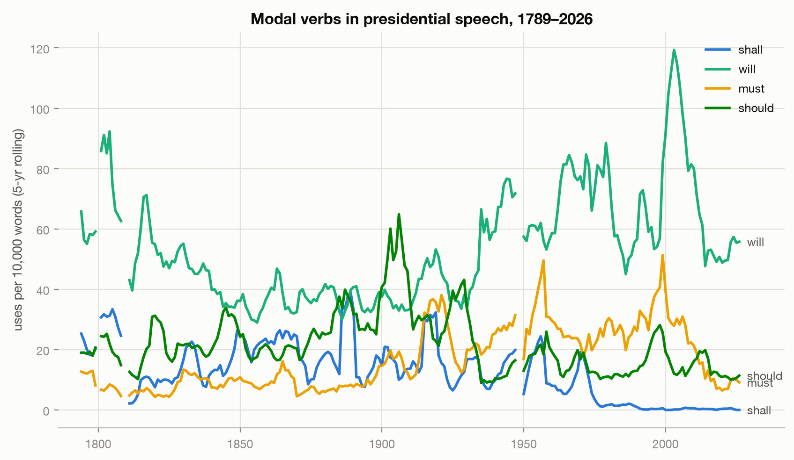

# Presidential Profiles

How presidential rhetoric, issues, and policies manifest for each president — and across the
whole sweep of U.S. history. An NLP analysis of every speech in the
[Miller Center](https://millercenter.org/the-presidency/presidential-speeches) corpus:
**1,057 speeches, 4.2 million words, George Washington's 1789 inaugural through April 2026.**

Originally a 2019 Galvanize data-science capstone; rebuilt in 2026 on the official Miller Center
data release with a modern Python pipeline. The original code is preserved in [`legacy/`](legacy/).

## Findings

### Who sounds like whom

Every speech is embedded ([model2vec](https://github.com/MinishLab/model2vec) static embeddings),
averaged per president, and projected to 2D with PCA. **The first principal component is,
almost perfectly, time** — presidents drift steadily across the map in chronological order,
even though the model never sees a date. The modern era (FDR onward) forms its own tight
cluster, far from the founders.


The pairwise similarity matrix tells the same story: a dark "modern block" starting around FDR.
The most similar pair of presidents in the whole corpus is **Bill Clinton ↔ Barack Obama**
(cosine 0.978). Among presidents with substantial speech records, **Donald Trump is the most
rhetorically distinct from everyone else** — his average similarity to the other 44 presidents
is the lowest of any president not cut short after a handful of speeches (only William Harrison,
who died a month into office, and James Garfield rank lower).


Interactive versions with hover detail:
[president map](outputs/interactive/president_map.html) ·
[similarity heatmap](outputs/interactive/similarity_heatmap.html)

### The 2020s flipped the pronoun trend

Presidential speech spent a century becoming more collective: "we / us / our" climbed from
~100 uses per 10,000 words in 1900 to ~400 in the 2010s. **The 2020s reversed it.** "We" fell
back to 329 while first-person singular ("I / me / my") surged to 234 per 10k words — the
highest of any decade since George Washington's personal addresses in the 1790s.


### The death of "shall"

The classic marker of formal obligation collapsed from **21.8 uses per 10k words in the 1790s
to 0.35 today**. "Must" rose in its place through the FDR/war years, and "will" — promising,
future-facing — took over modern speech, peaking around 2000.



### Speeches dropped twelve grade levels

Median Flesch–Kincaid reading level fell from **grade 19.9 in the 1790s to grade 7.8 in the
2020s** — from dense written orations addressed to Congress to televised (and tweeted) plain
speech addressed to everyone.


### What presidents talk about, 1789–2026

Twelve NMF topics over the full corpus trace the arc of American history: treaties and
commerce dominate the early republic, the Constitution and union peak in the 1860s, gold and
silver in the 1890s, tariffs around 1910, the Soviet/nuclear block in the Cold War, Vietnam in
the 1960s–70s, Iraq/Afghanistan in the 2000s — and a "think · lot · got" informal-register
topic that barely existed before television and explodes in the 2020s.


Keyword rates per 10k words show the same history in single words — note **"border" and
"immigration" reaching all-time highs in the 2020s**, well above the previous immigration-era
peaks of the early 1900s:


### What's new since 2019

Log-odds comparison (Monroe et al. informative Dirichlet prior) of the 64 speeches added since
this project's original 2019 snapshot against the 1989–2019 baseline: **ukraine, china,
testing** (the COVID era), and a marked shift toward informal narration — "going", "said",
"really", "yeah" as statistically distinctive presidential vocabulary.


## Data

The corpus is the Miller Center of Public Affairs (University of Virginia) official speech
release: [data.millercenter.org](https://data.millercenter.org). Speeches are in the public
domain; the collection is curated by Miller Center staff and is not exhaustive. Attribution:
Miller Center of Public Affairs, University of Virginia.

`data/speeches.parquet` is the normalized corpus (one row per speech, cleaned plain-text
transcript). The other parquet files are derived tables the pipeline caches so you can explore
results without recomputing.

## Running it

Requires [uv](https://docs.astral.sh/uv/). Then:

```bash
uv sync                 # install pinned environment (Python 3.12)
uv run pp-fetch         # download + normalize the corpus  -> data/speeches.parquet
uv run pp-analyze       # full pipeline                    -> outputs/
```

`pp-analyze --force` recomputes the cached intermediate tables. The spaCy tagging pass over
4.2M words takes a few minutes; everything else is seconds.

## How it works

| Stage | Module | Method |
|---|---|---|
| Fetch | `fetch.py` | Official corpus tarball → cleaned parquet (HTML/stage-direction stripping) |
| Linguistic stats | `rhetoric.py` | One spaCy pass: modal verbs, pronouns, sentences, Flesch–Kincaid |
| Topics | `topics.py` | TF-IDF + NMF (12 topics, seeded) |
| Similarity | `similarity.py` | model2vec embeddings → per-president mean → cosine + PCA |
| Vocabulary shift | `trends.py` | Keyword rates; log-odds with informative Dirichlet prior |
| Figures | `figures.py` | matplotlib PNGs + plotly interactive HTML, validated palette |

## Then and now

The 2019 capstone scraped the Miller Center with Selenium, POS-tagged word-by-word with NLTK
(181 batch CSVs processed on AWS), stored results in a local PostgreSQL database, and embedded
sentences with ELMo on TensorFlow 1. The 2026 rebuild replaces all of it:

| 2019 | 2026 |
|---|---|
| Selenium scraper, 90 page-scrolls | Official corpus download |
| NLTK word loop on AWS (156 MB of intermediate CSVs) | Single streamed spaCy pass |
| Local PostgreSQL | Parquet files |
| ELMo + TensorFlow 1 | model2vec static embeddings |
| Notebook-driven NMF/LDA | Seeded, reproducible `pp-analyze` CLI |

The original scripts, notebooks, and graphs live in [`legacy/american_values/`](legacy/american_values/).
